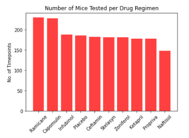
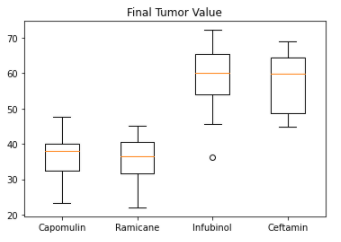
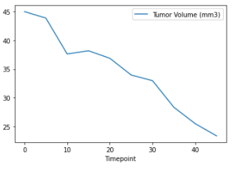
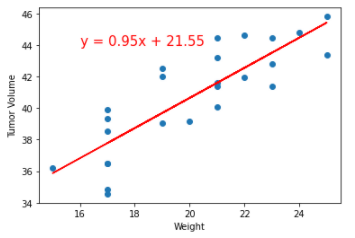

# Matplotlib---Power-of-Plots
# Introduction
This analysis looks at the effect of Capomulin on mouse tumor volume  in comparison to Ramicane, Infubinol and Ceftamin.
# Overview
Data on 248 mice was analyzed. Half the mice were male. The mice were divied into groups and they were treated with 10 different drugs including placebo: Ramicane, Capomulin, Infubinol, Placebo, Ceftamin,Stelasyn, Zoniferol, Ketapril, Propriva, and Naftisol. to analyze how they affected tumor growth. Periodically the mice were weighed, their tumor volume was measured and their metastatic sites were counted. This is the analysis of Capomulin's performance.
# Methodology
Two reports were merged for the analysis; mice metadata and study results. A mouse was removed from the study due to duplicate data associated with its ID. The summary statistics focus on Capomulin and three other drugs: Racicane, Infubinol and Ceftmain.
# Analysis
A bar chart for the ten medications that looked at total number of timepoints shows that Capomulin and Ramicane had the most timepoints, meaning these mice lived the longest.

The final tumor volume of each mouse was calculated across four of the treatment regimens: Capomulin, Ramicane, Infubinol, and Ceftamin. The box plot generated shows the mice treated with Capomulin and Ramicane had significantly smaller tumor volumes thans Infubinol and Ceftamin.

Looked at on its own, Capomulin had mice that lived the longest; as exhibited in this line graph. The graph shows that as the mouse moved to towards the last timepoint, its tumor volume was steadily decreasing.

This last scatter plot shows that there is a postive correlation between the mouseweight increasing as the tumor volume increases.

# Conclusions
Capomulin was one of the best performing drugs in this study. Ramicane performed similarly. Both drugs should be further studied for usefulness in the treatment of tumors.